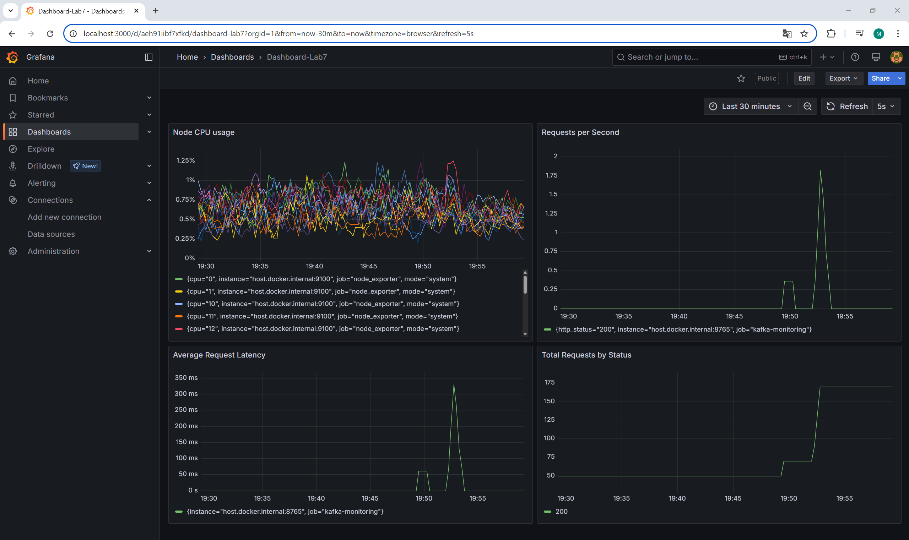
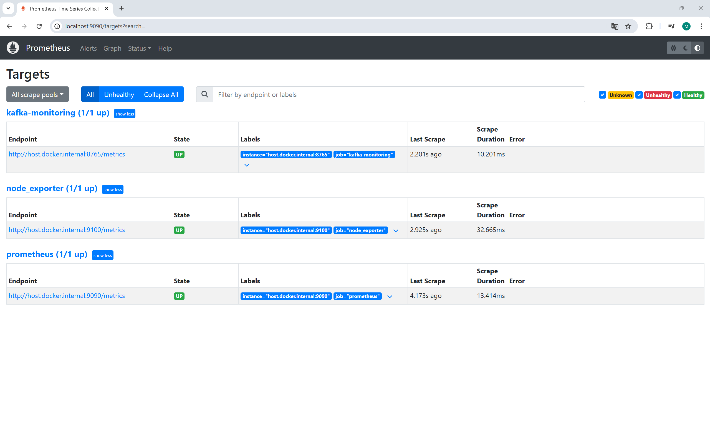
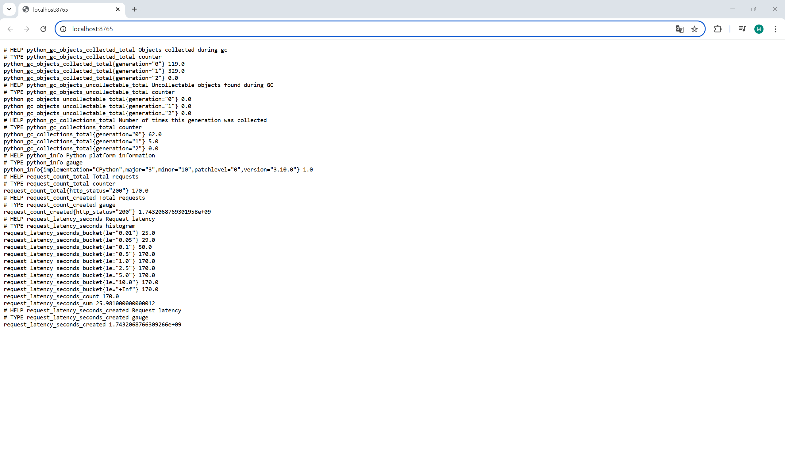

# Lab 7: Monitoring using Prometheus and Grafana

## Deliverables
- [ ] Setup Docker with Prometheus and Grafana.	Modify and Run Kafka Monitoring Script.
- [ ] Verify Prometheus targets and metrics. Run queries in prometheus.
- [ ] Configure Grafana Dashboard and add visualizations.

**Screenshots**

